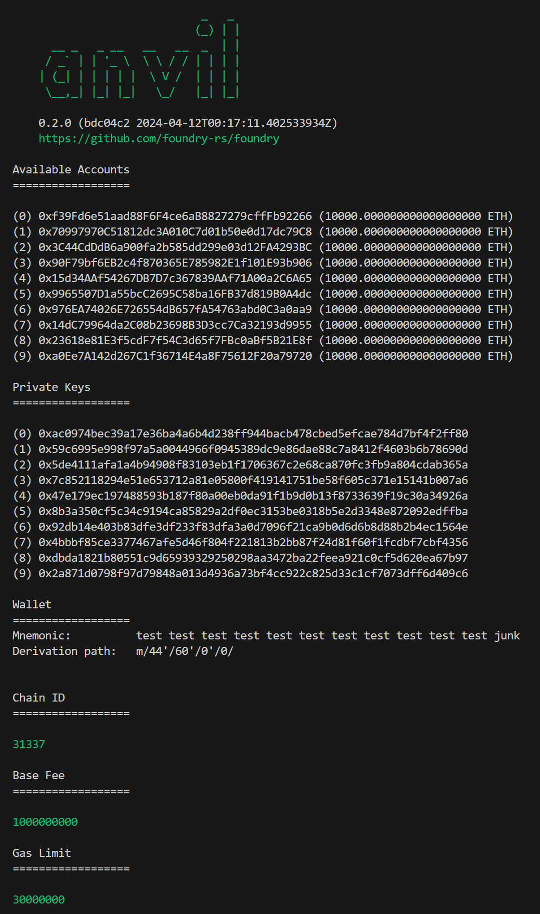

### Deploying a smart contract

There are multiple ways and multiple places where you could deploy a smart contract.

While developing using the Foundry framework is the easiest and most readily available place for development is Anvil.

Anvil is a local testnet node shipped with Foundry. You can use it for testing your contracts from frontends or for interacting over RPC.

To run Anvil you simply have to type `anvil` in the terminal.

You now have access to 10 test addresses funded with 10_000 ETH each, with their associated private keys.

