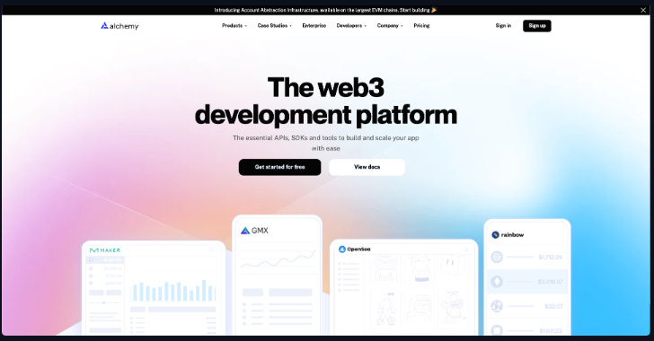

### Deploying our Contract to Testnet or Live Network with Foundry and Alchemy

Hi, everyone! Are you curious about what your contract would look like on a testnet or a live network? If so, buckle up because this blog post will cover exactly that! We'll walk through the process of updating our Envrionment Variable (.env) file for an actual testnet.

Clearly, we need an actual testnet for a real network. But our trusty MetaMask has built-in Infura connections that are incompatibly. Why? Because they're tailored specifically for MetaMask. Hence, we need our own Remote Procedure Call (RPC) URL.

### Creating our Own RPC URL for a Testnet

*To create one, we could run our own blockchain node, but let's be honest — many folks prever avoiding that route. Instead, we utilitze Node as a Service (NaaS) applications to expedite the process.*

One promising option is using Alchemy - a free NaaS platform that we can send the transactions to. This procedure resides within the Deploying to Testnet or Mainnet section in the full course repo of the Foundry.



To access the Alchemy platform, we simply click on the aforementioned function. On the platform, we sign up (I used Google sign-in for this demo).

Our next step is creating a new app in the Alchemy user interface. I named mine *Sepolia Testing* and kept the description the same, given that our chain will be an Ethereum one based on Ethiopia.

We can bypass advanced features for now and finalize our app. Now we have the app details needed for our node, including frequency of calls and other details. We also have a new https endpoint by clicking view key, which functions exactly the same way as our ganache or MetaMask endpoint.

### Altering our Private key

Next, let's do something about our private keys. Our ganache private key will no longer cut it — it has neither real money nor any testnet ETH in it.

Our solution is to use one of our MetaMask private keys. To do this, we switch back to Sepolia in our MetaMask, choose an account with money in it, click on account details, and export the private key. *Remember, never share your real private key!*

Upon confirmation with your password, copy the private key and omit the line in the env file — hashtag or poind sign denoting comments.

### Executing the Transaction

With our Sepolia RPC URL and private key from MetaMask, executing a transaction now becomes tremendously easier.

```bash
source .env
forge script script/deploySimpleStorage.s.sol --rpc-url=$Sepolia_RPC_URL --private-key=$PRIVATE_KEY --broadcast
```

This command deploys our contract to the testnet, and we can monitor the transaction on our Alchemy dashboard.

We soon find that our contract, Simple Storage, has been deployed on the Sepolia chain. We can grab our transaction hash and input it into Sepolia ether scan IO to confirm the successful transaction.

AFter we refresh our Alchemy dashboard, we'll verify the requests sent and track the ETH send raw transaction that transmitted our transaction to the blockchain.

So, this is how we deploy our contract on a real testnet leveraging Foundry and Alchemy!

Our next step will explore adding real-world components to the mix. Stay tuned!

### Updates

#### Errors using foundry version 0.20.0 (Updated July 14, 2024)

Some you might encounter some troubles if you are using foundry version `0.20.0` causing this error:

`failed to read artifact source file for...`

This is being reported already on the official [Foundry Repo](https://github.com/foundry-rs/foundry/issues/6572) and for now there is not a clear answer but we have two hotfixes that might help.

1. Change the way you import the files on the contract, please check the issue for more context.
2. Downgrade the Foundry version: `foundryup -v nightly-5b7e4cb3c882b28f3c32ba580de27ce7381f415a`
### Obtaining testnet funds -> Tenderly virtual testnets (updated July 26, 2025)

Obtaining testnet funds can be difficult as faucets often require you to hold mainnet funds or sign in with some other service like GitHub.

So, instead of deploying and interacting on a testnet like Sepolia, you can use a Tenderly virtual testnet. More information on creating your own virtual testnet can be found in [this video](https://updraft.cyfrin.io/courses/blockchain-basics/basics/sending-your-first-transaction-tenderly)!

Note that, as of today, Tenderly does not support ZKsync.