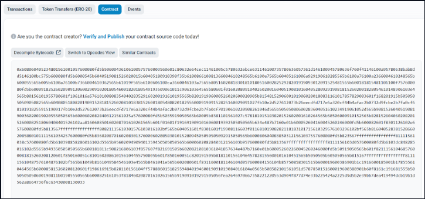

### Manuall verify a smart contract on Etherscan

Sooo... we just deployed our smart contract on Sepolia, let's check it out!

We go [here](https://sepolia.etherscan.io/address/0x1093560Fe9029c4fB9044AbF2fC94288970D98Db#code) click on `Contract` and find this:



This bytecode looks horrendous. We need to do something to improve the readability (which is currently is non-existent).

Etherscan is prompting us to do something about it via the messsage: `Are you the content creator? Verify and Publish your contract source code today!`

So, let's click on `Verify and Publish`.

The address of the Contract comes prepopulated, if not please paste it from your terminal.

Select `Solidity(Single file)` because we are using solidity and we have only one file.

Select `Solidity(Single file)` because we are using solidity and we have only one file.

Select your Compiler Version. My contract used solidity 0.8.19.

The license type we used is MIT.

On the next page, paste your Solidity Contract. Select `Yes` in `Optimization`, and leave everything else as is.

Finish up the `verify` process. If you get this message:

```solidity
Successfully generated Bytecode and ABI for Contract Address [0x1093560Fe9029c4fB9044AbF2fC94288970D98Db]
```

You did it right!

Now you have access to the `Read Contract` and `Write Contract`. This lets you interact directly with your contract through etherscan.

Congrats! You just learned how to verify a smart contract on ehterscan, the manual way. This is not the ideal way, in the future, we will teach you how to verify them programmatically.